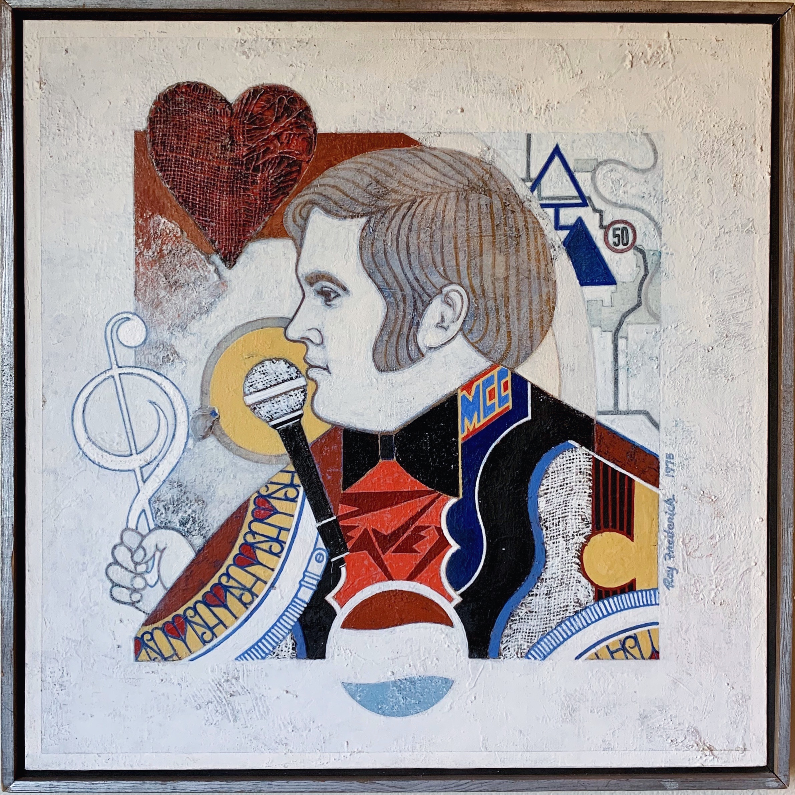

On July 11th I attended an [art show](https://www.timesrepublican.com/news/todays-news/2022/06/ray-frederick-art-show-auction-held-at-mcc/) of work by the late Ray Frederick at Marshalltown Community College. I had looked forward to this weekend for a while. At one point I thought it might be possible to take [my dad](/ancestry/ancestors/samuel-e-crain/), who was a student and friend of Ray’s. But the show was delayed a few times, first because of the pandemic and then because of [the derecho](https://www.washingtonpost.com/weather/2020/10/17/iowa-derecho-damage-cost/). My hometown has [been through a lot in recent years](https://en.m.wikipedia.org/wiki/Iowa_tornado_outbreak_of_July_2018) and is still picking up the pieces. 

I arrived with about an hour left in the bidding. I felt rushed to survey the work and worried I might second guess my choice. There were a few pieces in a bright geometric and unfamiliar style that caught my eye. They were much different from the work I had seen from him before.

Ray and Annice’s daughter Denise introduced me to several people—some who knew my dad. Among these, I met [Chris Chantland](https://chrischantland.com/) a student of Ray’s and a talented artist in his own right. We exchanged memories of visits with Ray and Annice and shared photos of paintings on our phones. I shared a photo of a painting Ray made of my dad.

<figure>

<figcaption>Sam. Acrylic and mixed media. 1975. </figcaption>
</figure>

Even at a young age, my interests were in creative work. I took for granted that I knew working artists, people who made a life by forming their talents. As others my age were choosing more conventional career paths this knowledge helped me brush aside their doubt. What a gift, an experience most don’t have. I think this is what my dad valued most in his relationship with Ray—the courage needed to do the things _only he_ could do. 

I won bids on two very different paintings. I was pleased. Later that night I found myself looking through photos of my dad. I came across several with Ray’s artwork in frame. In one he held his guitar, seated in front of one of the paintings I’d purchased that day. What a surprise and a special moment for me.

