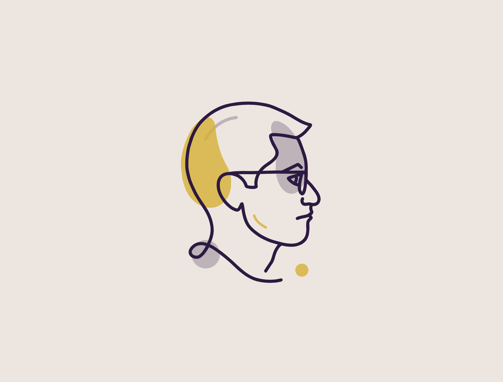
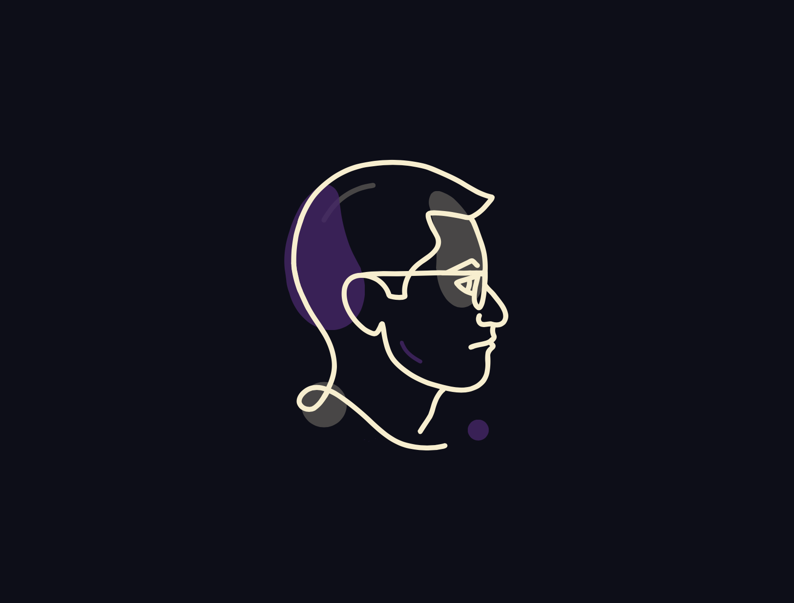

As 2022 draws to a close I have taken a few moments to look back over the last year. In doing so I realized there was work I had done and it is worth acknowledging. I had been thinking about adding an illustration to the homepage. It would be light, scalable, and adaptable to different environments or themes. An SVG would be ideal.

<figure>

<figcaption>Self-Portrait Light Theme. Digital/SVG. 2022.</figcaption>
</figure>

I had been drawing and painting with Adobe Fresco but hadn't experimented much with vector brushes. They seemed like the perfect application. I had already used CSS custom properties to theme other elements, so why not an SVG?

Once I completed the illustration in Fresco I used VSCode to edit and SVGO to optimize it. Later, I realized there were further optimizations that I could make. Fresco did not merge overlapping shapes thus adding redundant paths. To optimize it I opened the illustration in Figma and merged the overlapping paths. Then I was done.

I shared the work on Twitter and was excited to see *retweets* from Eric Snowden and Kyle Webster. Snowden is the VP of Design at Adobe and Webster is an illustrator, digital brush creator, and product evangelist at Adobe.

<figure>

<figcaption>Self-Portrait Dark Theme. Digital/SVG. 2022.</figcaption>
</figure>

